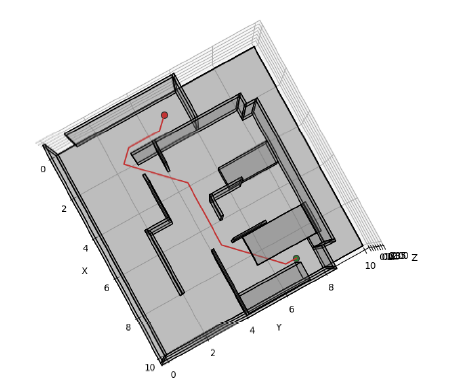
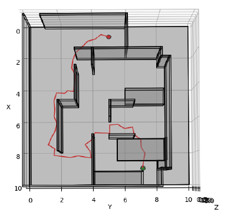

# Motion Planning in 3D Euclidean Space

## Project Overview

This project focuses on the evaluation and comparison of search-based and sampling-based motion planning algorithms in 3-D Euclidean space. The primary goal is to assess their performance in generating optimal paths while navigating through 3-D environments containing obstacles. The evaluation includes the implementation of collision-checking algorithms and testing two prominent algorithms: the weighted A* search-based algorithm and the sampling-based RRT algorithm. These algorithms are tested on seven different 3D environments, and the comparison is based on path quality, the number of expanded nodes, and the impact of heuristic function selection and sampling choices.

## Features

1. *Algorithm Comparison*: The project compares the performance of two prominent motion planning algorithms, namely the weighted A* search-based algorithm and the sampling-based RRT algorithm, in 3-D Euclidean space.

2. *Collision Detection*: The implementation includes a collision-checking algorithm to ensure that generated paths are collision-free, making it suitable for real-world applications.

3. *Multiple Environments*: The algorithms are evaluated on seven different 3D environments, each consisting of varying obstacle configurations, allowing for a comprehensive assessment of their effectiveness.

4. *Path Quality Evaluation*: The project measures and visualizes the quality of generated paths, providing insights into how well the algorithms navigate complex environments.

5. *Node Expansion Analysis*: It analyzes and compares the number of nodes expanded by each algorithm during path planning, helping to assess their computational efficiency.

6. *Heuristic Function Impact*: The project investigates the impact of heuristic function selection on algorithm performance, allowing for a deeper understanding of their behavior.

7. *Sampling Choices Examination*: It explores the influence of different sampling choices in the RRT algorithm, shedding light on the importance of randomization in motion planning.

8. *Real-world Relevance*: Motion planning is a fundamental component of autonomous systems, and this project's findings have practical implications for robotics and autonomous vehicles.

## Project File Structure

### Datasets

The dataset [maps](Code/maps) consisting of 3-D environments. Each environment is characterized by its outer boundary, rectangular obstacle blocks, start coordinates, and goal coordinates. Here are the key components of the dataset:

1. **Outer Boundary:** The 3-D environment is enclosed by a rectangular outer boundary, defining the spatial limits for motion planning.

2. **Rectangular Obstacle Blocks:** Within the environment, there are rectangular obstacle blocks. Each block is described by a 9-dimensional vector, including:
    - `(xmin, ymin, zmin)`: Coordinates of the lower-left corner of the obstacle block.
    - `(xmax, ymax, zmax)`: Coordinates of the upper-right corner of the obstacle block.
    - `(R, G, B)`: RGB color values for visualization.

3. **Start Coordinates (`xs`):** For each environment, the starting coordinates `xs` are specified, representing the initial position.

4. **Goal Coordinates (`xg`):** The goal coordinates `xg` are also provided, indicating the desired destination within the environment.

### Source Code

Python files

- [main_astar.py](Code/main_astar.py) and [main_rrt.py](Code/main_rrt.py) - These files contain helper functions to load and display the environments and  call a motion planner (A* / RRT) and plot the planned path. 
- [astar.py](Code/astar.py) - This file contains a class defining a node for the A* algorithm as well as the complete implementation of A*.
- [rrt.py](Code/rrt.py) - This file contains a class defining a node for the RRT algorithm as well as the complete implementation of RRT.


## How to run the code

### FOR ASTAR ###

#### Files required:
1. [main_astar.py](Code/main_astar.py)
2. [astar.py](Code/astar.py)

#### Step 1:
In the [main_astar.py](Code/main_astar.py), choose the desired environment (environments are present in [maps][Code/maps] folder) in the `main` function and set the map resolution according to the environment mentioned below. The map resolution is set in the `offset` variable defined in the `runtest()` function.

- Environment Map Resolutions:
    - Cube: 0.1 m
    - Maze: 0.5 m
    - Flappy Bird: 0.3 m
    - Monza: 0.2 m (A*), 0.5 m (RRT)
    - Window: 0.5 m
    - Tower: 0.5 m
    - Room: 0.5 m

#### Step 2:
Run the `main_astar.py` file after updating the changes as mentioned in step 1.

 - In the terminal, use the following command:
     ```bash
     python main_astar.py
     ```

Output: Plot of Path planned by A* in the chosen 3D environment

### FOR RRT ###

#### Files required:
1. [main_rrt.py](Code/main_rrt.py)
2. [rrt.py](Code/rrt.py) 

#### Step 1:
In the [main_rrt.py](Code/main_rrt.py), choose the desired environment (environments are present in [maps][Code/maps] folder) in the `main` function and set the map resolution according to the environment mentioned in A* section. The map resolution is set in the `edge_length` variable defined in the `runtest()` function.

#### Step 2:
Run the [main_rrt.py](Code/main_rrt.py) file after updating the changes as mentioned in step 1.
 - In the terminal, use the following command:
     ```bash
     python main_rrt.py
     ```
Output: Plot of Path planned by RRT in the chosen 3D environment

## Results

The results section provides insights into the Motion Planning algorithm's performance in various environments. These results demonstrate that the choice between A* and RRT depends on various factors, including map complexity, path length, computational resources, and smoothness of the path. 

For example, for the Room Map, the path planned by A* and RRT are shown: 

|A* path|RRT path|
|---|---|
|||


## Conclusion

In conclusion, this project compared search-based A* and sampling-based RRT algorithms for 3-D motion planning. While A* demonstrated superior path quality and efficiency, RRT showcased faster and more memory-efficient performance, particularly in high-dimensional spaces. The choice between these algorithms depends on factors like map complexity, available resources, and the balance between optimality and efficiency. Future work may explore advanced search-based algorithms and RRT* variants for further improvements.

**Contributing:**

Contributions to this project are welcome! If you have any suggestions, find issues, or want to contribute code, please feel free to open an issue or submit a pull request.
